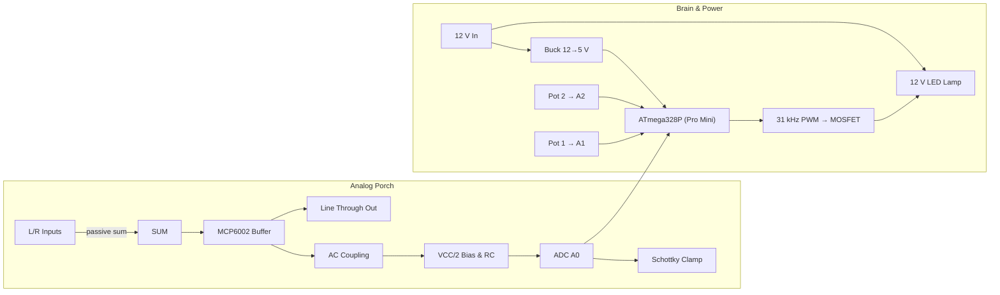
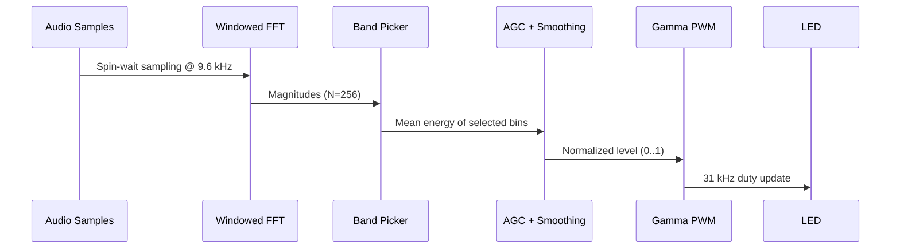

# LineLight‑1 — a listening lamp for artists

**One lamp, two knobs, line‑through.** LineLight‑1 listens to a slice of your **line‑level** signal and maps its
energy to a clean, quiet LED brightness. No capture, no telemetry—just glow.

## System-at-a-glance


The analog porch stays transparent while the digital core analyses the energy band you dial in. No wireless, no
cloud, no surprises.

## Firmware signal flow


## Why
- On stage or in studio you need a **legible**, **non-distracting** cue.
- You want to **choose the band** (kick, vocal sibilance, airy shimmer) and keep it steady across different mixes.
- You want a device that’s **auditable**: open schematics, readable firmware, privacy-first.

## Features (v0.1.0, 2025-09-29)
- Line‑level **through** path with high‑Z buffer.
- Two pots set **FFT band** (low/high edges).
- **AGC + smoothing** for musical response.
- **31 kHz PWM** LED drive (no audible whine).
- Single 12 V input (buck to 5 V for MCU).

## Quick build
1. Assemble the analog porch (see _docs/build-guide.md_):
   - L/R passive sum → op‑amp buffer (MCP6002).
   - AC‑couple → bias at VCC/2 → ADC (A0) with small RC.
   - Schottky clamps to protect the ADC.
2. Wire MOSFET gate to **D9**; 12 V LED lamp on the drain; common ground.
3. Flash firmware via **PlatformIO** using a SparkFun **FTDI Basic (5 V)** on the 6-pin programming header:
   ```sh
   pio run -t upload
   pio device monitor
   ```
   Wire DTR→RESET, TXO→RXI, RXI→TXO, VCC→VCC (5 V), CTS→GND. The Pro Mini has no native USB, so this header is your lifeline.
4. Send pink noise; turn the knobs to pick your band. The lamp should breathe to the music.

## Safety
- Ship **low‑voltage** only by default (12 V LED loads). If you need mains dimming, use a certified SSR/triac module in an enclosed, fused chassis and treat this repo as **control-signal only**.
- Audio grounds can be fickle. If you hear hum in certain rigs, add the **isolation transformer** variant.

## Limitations & upgrades
- Pro Mini FFT is coarse; for sharper bands use a **Teensy** or external **MSGEQ7**.
- v0.1 is **unbalanced** I/O. v1.1 adds transformers or THAT‑based balanced front/back.
- Add BLE/UART config later to set bands without opening the box.

## Roadmap
- v0.1.0 — buffer tap, single lamp, pots for band.
- v1.1.0 — bypass relay/mute FET, balanced I/O option.
- v2.0.0 — multi‑lamp + BLE config.

## Licenses
- **Code**: MIT (see _LICENSES/code-MIT.txt_)
- **Hardware**: CERN‑OHL‑S v2.0 (see _LICENSES/hardware-CERN-OHL-S.txt_)

## Ethics
See _docs/PRIVACY_ETHICS.md_: local‑only processing, no storage, clear status behavior, and a public assumption ledger.
