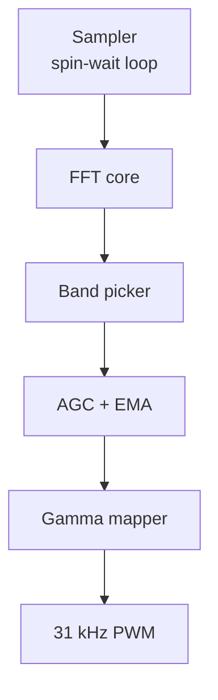

# Firmware shop manual

This folder houses the PlatformIO project that turns spectral energy into lamp brightness. The comments in `src/main.cpp`
are intentionally long-form so you know the thinking behind every line. Target hardware is the SparkFun **Pro Mini 5 V/16 MHz**
flashed through a SparkFun FTDI Basic (5 V).

## Build + flash
```sh
pio run
pio run -t upload
pio device monitor
```
- Hook up the FTDI Basic: DTR→RESET, TXO→RXI, RXI→TXO, VCC→VCC (5 V), CTS→GND.
- `pio run -t upload` toggles DTR to reset the Pro Mini—no extra button mashing required if the header is wired right.

## Module map


- **Sampler** holds timing steady without ISRs so the analog porch can be debugged in isolation.
- **FFT core** uses `arduinoFFT` with a Hann window you can audit in ROM. 128-point frames stay inside the Pro Mini's
  2 KB SRAM while still giving ~75 Hz bin spacing at 9.6 kHz sampling.
- **Band picker** translates the panel knobs into bin ranges with guard rails.
- **AGC + EMA** does the vibe-polishing—no hard clipping, no drama.
- **Gamma mapper** makes LED brightness feel linear to human eyes.
- **31 kHz PWM** keeps the MOSFET and lamp silent.

## Production notes
- Release build flags (`-Os`, LTO, section GC) are set in `platformio.ini` so shipping firmware runs cool.
- Serial logs throttle to 1 Hz so the FTDI stream stays readable during validation.
- If you move to an ISR sampler later, keep the function boundaries—they make it trivial to unit-test on a desktop build.
